# Smart NOC — Software Architecture Document
**Application Version:** `v0.6.0`  
**Target Environment:** Windows 10 / 11 / Windows Server (24x7 Headless / Desktop Operation)  
**Database Engine:** PostgreSQL 12+  
**Primary Stack:** Python 3.10+ / Flask / React 19 / TypeScript / Tailwind CSS / Chart.js 4  

---

## 1. Executive Summary & System Overview

**Smart NOC** is a modular, high-availability Network Operations Center (NOC) monitoring and management platform specifically engineered for Internet Service Providers (ISPs), fiber networks, and Optical Line Terminal (OLT) deployments.

The platform unifies real-time event telemetry (SNMP Traps, Syslog), file backup intake (TFTP), ICMP ping reachability, OLT/ONT optical inventory extraction, multi-channel alert dispatching (Discord, Telegram, Email), and in-app system power management into a cohesive, single-pane-of-glass architecture.

```mermaid
graph TD
    subgraph Network Devices [Network Infrastructure]
        OLT[OLT / Switches / Routers]
        ONT[Customer ONUs / ONTs]
    end

    subgraph Ingestion Layer [Network Ingestion Daemons]
        TRAP[trap_receiver.py<br/>UDP 162]
        SYSLOG[syslog_server.py<br/>UDP 5141]
        TFTP[tftp_server.py<br/>UDP 69]
        OLT_CONN[olt_connector.py<br/>SSH / Telnet]
    end

    subgraph Core Engine Layer [Application Core & APIs]
        API[api.py<br/>Flask Web & REST API<br/>TCP 5000 / 5443]
        ALERT[alert_engine.py<br/>Multi-Channel Notifier]
        PING[Ping Engine Worker<br/>in api.py]
        HEALTH[Health & Power Manager<br/>in api.py]
        LAUNCHER[launcher.pyw<br/>Process Supervisor & Watchdog]
    end

    subgraph Storage Layer [Persistence]
        PG[(PostgreSQL DB<br/>Smart NOC Instance)]
        FS[Local File Storage<br/>/backups, /logs, /data]
    end

    subgraph Notification Layer [External Notifications]
        DISCORD[Discord Webhooks<br/>Color-Coded Embeds]
        EMAIL[SMTP Email Server<br/>HTML & Status Dots]
        TG[Telegram Bot API<br/>HTML Formatted]
    end

    subgraph Presentation Layer [User Interfaces]
        SPA[React 19 + TypeScript SPA<br/>Watermelon UI / Tailwind CSS<br/>frontend/dist/]
        LEGACY[dashboard.html / login.html<br/>Vanilla JS Legacy Fallback<br/>/?legacy=1]
    end

    %% Network flows
    OLT -- "SNMP Traps (UDP 162)" --> TRAP
    OLT -- "Syslog Messages (UDP 5141)" --> SYSLOG
    OLT -- "Config Backups (UDP 69)" --> TFTP
    OLT_CONN -- "CLI Polling (SSH/Telnet)" --> OLT
    PING -- "ICMP Echo" --> OLT
    PING -- "ICMP Echo" --> ONT

    %% Process Supervision
    LAUNCHER -.->|Supervises & Restarts| TRAP
    LAUNCHER -.->|Supervises & Restarts| SYSLOG
    LAUNCHER -.->|Supervises & Restarts| TFTP
    LAUNCHER -.->|Supervises & Restarts| API

    %% Processing to Storage & Alerting
    TRAP -->|Parsed Traps & Events| PG
    TRAP -->|Trigger Rule Eval| ALERT
    SYSLOG -->|Parsed Logs & Events| PG
    SYSLOG -->|Trigger Rule Eval| ALERT
    TFTP -->|Store File & Metadata| PG
    TFTP -->|Write File| FS
    OLT_CONN -->|ONU & Uplink Records| PG
    PING -->|Ping State & Latency| PG
    PING -->|Trigger Offline/Restore| ALERT
    HEALTH -->|System & Process Diagnostics| PG

    %% Alerting out
    ALERT --> DISCORD
    ALERT --> EMAIL
    ALERT --> TG
    ALERT -->|Log Dispatched Alerts| PG

    %% Presentation to API
    API <-->|SQL Queries / Connection Pool| PG
    API <-->|Read / Write Backups & Logs| FS
    API -->|Serves React SPA Bundle| SPA
    API -->|Serves Legacy Fallback| LEGACY
```



---

## 2. File & Component Interdependency Matrix

The application follows a decoupled daemon architecture where all components communicate asynchronously through shared database tables, common configuration tokens, and loopback REST calls.

| Component / File | Process Type | Primary Responsibilities | Key Upstream & Downstream Dependencies |
| :--- | :--- | :--- | :--- |
| [`noc_config.py`](file:///h:/Github/SNOC/noc_config.py) | **Configuration** | Central configuration repository, port mappings, retention parameters, and PostgreSQL connection pool initialization (`query_db`, `execute_db`, `get_db_connection`). | Imported by **all** Python modules (`api.py`, `alert_engine.py`, `trap_receiver.py`, `syslog_server.py`, `tftp_server.py`, `olt_connector.py`, `launcher.pyw`). |
| [`launcher.pyw`](file:///h:/Github/SNOC/launcher.pyw) | **Supervisor GUI** | Process orchestrator, Tkinter tray/window controller, service heartbeat monitor, and self-healing watchdog (auto-restarts hanging API instances). | Spawns `api.py`, `trap_receiver.py`, `syslog_server.py`, `tftp_server.py`; communicates via HTTP health checks. |
| [`api.py`](file:///h:/Github/SNOC/api.py) | **Web Server & Core API** | Flask application (HTTP 5000 / HTTPS 5443), PBKDF2 authentication, RBAC session handling, REST API endpoints, background Ping Worker, Retention Cleaner, Diagnostic Health Engine, OLT Polling Scheduler (`olt_job_scheduler`), and Power Lifecycle handlers (`/api/system/restart`, `/api/system/shutdown`). | Reads/writes PostgreSQL via `noc_config.py`; serves React 19 SPA and legacy UI; executes `alert_engine.py` for ping triggers; calls `olt_connector.py` for live scans and background scheduled polls. |
| [`frontend/`](file:///h:/Github/SNOC/frontend/) | **React 19 + TypeScript SPA** | Modern Single Page Application built with React 19, TypeScript, Tailwind CSS 3.4, Lucide icons, and Watermelon UI design system ([ui.watermelon.sh](https://ui.watermelon.sh)). Provides 11 operational modules, polling hooks, Chart.js 4 telemetry graphs, and studio modal controls. | Served directly by `api.py` from `frontend/dist/` at `/` and `/login`. |
| [`dashboard.html`](file:///h:/Github/SNOC/dashboard.html) | **Presentation SPA (Legacy Fallback)** | Classic single-page UI with 11 operational tabs, Chart.js real-time graphing, drag-and-drop tab ordering, and modal management. | Fallback UI served when `/?legacy=1` is requested. |
| [`login.html`](file:///h:/Github/SNOC/login.html) | **Authentication UI (Legacy)** | Standalone login page handling credentials and session establishment. | Submits authentication requests to `api.py` (`POST /api/auth/login`). |
| [`alert_engine.py`](file:///h:/Github/SNOC/alert_engine.py) | **Alerting Service** | Direct multi-channel rule matching engine for Syslog events and Ping state changes; builds color-coded notifications (🔴 Red for DOWN, 🟢 Green for UP, 🟡 Yellow for Warning) and dispatches directly via Discord Embeds, Telegram Bot API, and SMTP HTML emails. | Invoked by `syslog_server.py`, `trap_receiver.py`, and `api.py` (Ping Worker); writes alert logs to PostgreSQL table `alert_log`. |
| [`syslog_server.py`](file:///h:/Github/SNOC/syslog_server.py) | **UDP Ingestion Daemon** | Listens on UDP port 5141, parses RFC 3164/5424 syslog streams, enforces Device Security Registration (Allow/Deny/Delete), persists to `syslog` table, and triggers rule checks in `alert_engine.py`. | Uses `noc_config.py` for DB connection and settings; calls `alert_engine.process_alert()`. |
| [`trap_receiver.py`](file:///h:/Github/SNOC/trap_receiver.py) | **UDP Ingestion Daemon** | Listens on UDP port 162, decodes SNMP v1/v2c trap payloads via PySNMP, translates enterprise OIDs via `vsol_mib.py`, persists records in `traps` table, and flags event alerts. | Uses `vsol_mib.py` for OID translation; uses `noc_config.py` for database persistence. |
| [`tftp_server.py`](file:///h:/Github/SNOC/tftp_server.py) | **UDP Ingestion Daemon** | Listens on UDP port 69, accepts binary and text configuration upload requests from network switches/OLTs, saves files to `/backups/`, and indexes records in `tftp_files`. | Uses `noc_config.py` for ports and directories; updates PostgreSQL `tftp_files` table. |
| [`olt_connector.py`](file:///h:/Github/SNOC/olt_connector.py) | **Hardware Library** | Paramiko-based SSH/Telnet automation engine for ZTE, VSOL, Huawei, and Fiberhome OLTs. Polls ONU tables, optical power (Rx/Tx dBm), CATV status, and interface uplink traffic counters with live progress callback dispatch. | Called by `api.py` during live scan requests and background scheduler worker (`olt_job_scheduler`). |
| [`vsol_mib.py`](file:///h:/Github/SNOC/vsol_mib.py) | **MIB Translation** | Static mapping table and translation parser for standard RFC MIBs and VSOL Enterprise OIDs (Enterprise ID `37950`). | Imported by `trap_receiver.py` and `olt_connector.py`. |
| [`gen_cert.py`](file:///h:/Github/SNOC/gen_cert.py) | **Security Tool** | Generates and validates self-signed 2048-bit RSA TLS/SSL certificates (`server.crt` and `server.key`) with Subject Alternative Names (SAN) for HTTPS support with self-healing consistency checks. | Run during installation or setup to provide HTTPS certificates for `api.py`. |
| [`check_downtime.py`](file:///h:/Github/SNOC/check_downtime.py) | **Audit Tool** | Audits background service log files (`logs/`) to detect time gaps and historical downtime intervals between consecutive heartbeat entries. | Standalone administrative command-line utility. |

---

## 3. Frontend Architecture (React 19 + Watermelon UI)

```text
frontend/src/
├── api.ts                     # Type-safe API client, 180s polling timeout manager & 401 interceptor
├── types/index.ts             # TypeScript domain schemas (Health, Syslog, OLT, ONUs, Ping)
├── context/
│   ├── AuthContext.tsx        # User authentication, RBAC tab permissions & role gating
│   └── ThemeContext.tsx       # Dark/Light theme state & HTML class management
├── hooks/
│   └── usePolling.ts          # Resilient interval polling with automatic cleanup
├── components/
│   ├── layout/
│   │   ├── AppLayout.tsx      # Collapsible Watermelon UI studio sidebar & header
│   │   ├── SettingsModal.tsx  # Retention, ports, tab visibility, session timeout
│   │   ├── RestartModal.tsx   # Targeted / All-service graceful restart modal
│   │   └── ShutdownModal.tsx  # Controlled headless stop modal
│   ├── shared/
│   │   └── StatusMessage.tsx  # Reusable alert and status feedback pill
│   └── olt/
│       └── OnuModal.tsx       # ONU snapshot summary stats, PON port selector, state filter & CSV export
└── views/
    ├── LoginView.tsx          # Studio dark login card with cyber grid glow
    ├── HealthDashboardView.tsx# 5 KPI cards, 3-way memory, 5-way MB storage, Kbps net rate
    ├── SyslogView.tsx         # Backend-authoritative receiving status, auth controls, event charts, stream table
    ├── OntLookupView.tsx      # Optical Rx power curve, distance in m/km, history
    ├── OltConnectView.tsx     # OLT profiles, ONU poll progress, automated scheduler
    ├── SnmpTrapsView.tsx      # Traps per OLT bar chart, trap volume, device cards
    ├── TftpBackupsView.tsx    # Backup files table, download/delete, MAC mappings
    ├── PingMonitorView.tsx    # ICMP latency bars, loss %, website launcher, history chart
    ├── UplinkTrafficView.tsx  # Multi-interface throughput curves (Mbps), Peak/Low metrics, port status cards
    ├── AlertsView.tsx         # SMTP, Telegram, Discord, rules engine & template editor
    ├── UsersView.tsx          # User management, RBAC tab scoping, AES-256 backup/restore
    └── LogsView.tsx           # Tail line selector, search filter, terminal color output
```

---

## 4. Security & Role-Based Access Control (RBAC)

1. **Authentication Engine**:
   - Password hashing via **PBKDF2-HMAC-SHA256** with 200,000 iterations and unique 16-byte random cryptographic salts.
   - Client session tokens stored in secure, HttpOnly, SameSite Flask session cookies with configurable inactivity timeouts (15, 30, 60, 120, 240, 480 minutes).
2. **Role Separation**:
   - `admin`: Full unrestricted access to all 11 tabs, system power controls (Restart/Shutdown), port configuration, retention parameters, user provisioning, and OLT configuration write operations.
   - `viewer`: Read-only telemetry access scoped strictly to administrator-assigned tabs, assigned OLTs, and assigned ping targets. Write and deletion APIs return HTTP 403 Forbidden.
3. **Network Daemon Protection**:
   - Syslog Device Gatekeeper: Automatically drops packets originating from unauthorized or denied IP addresses, protecting the PostgreSQL database against log injection and flooding attacks.
   - TFTP Path Traversal Prevention: Strips malicious relative path syntax (`../`) to guarantee uploads are confined strictly to the `/backups/` directory.
4. **Transport Layer Security & Self-Healing**:
   - Automatic TLS/SSL certificate resolver supporting HTTPS on configurable ports (default `5443`). Self-healing certificate regeneration via `gen_cert.py` if corruption or mismatch is detected.
5. **Disaster Recovery & Encrypted Backups**:
   - AES-256-GCM encrypted backup archive export and restoration (`/api/backup/download`, `/api/backup/restore`) securing credentials and system configuration.

---

## 5. Directory Layout & Storage Hierarchy

```text
SNOC/
├── api.py                    # Flask Web & REST API Core Backend
├── launcher.pyw              # Supervisor GUI & Watchdog Process
├── alert_engine.py           # Multi-Channel Alert & Rule Dispatcher
├── syslog_server.py          # UDP 5141 Syslog Listener Daemon
├── trap_receiver.py          # UDP 162 SNMP Trap Listener Daemon
├── tftp_server.py            # UDP 69 TFTP Backup Storage Daemon
├── olt_connector.py          # SSH/Telnet OLT & ONU Polling Engine
├── vsol_mib.py               # Enterprise MIB OID Dictionary
├── noc_config.py             # Central Application Settings & DB Pool
├── gen_cert.py               # TLS/SSL Certificate Generator & Validator
├── check_downtime.py         # Log & Uptime Gap Audit Tool
├── setup.py                  # Installation & Maintenance Engine
├── init_postgres.sql         # Base PostgreSQL Database DDL
├── dashboard.html            # Legacy Single-File Web UI (/?legacy=1 fallback)
├── login.html                # Legacy Login Page
├── frontend/                 # React 19 + TypeScript + Tailwind CSS Source
│   ├── src/                  # Components, Contexts, Hooks, Views
│   ├── dist/                 # Production Bundled Assets
│   ├── package.json          # NPM Dependencies & Scripts
│   ├── tailwind.config.js    # Watermelon UI Color Tokens & Shadows
│   ├── tsconfig.json         # TypeScript Configuration
│   └── vite.config.js        # Vite Build & Proxy Configuration
├── backups/                  # TFTP Uploads & Configuration Backups
├── data/                     # Local Application Cache & SSL Certs
└── logs/                     # Daemon Heartbeats & Runtime Logs
    ├── API_and_Dashboard.log
    ├── SNMP_Trap_Receiver.log
    ├── Syslog_Server.log
    └── TFTP_Server.log
```
